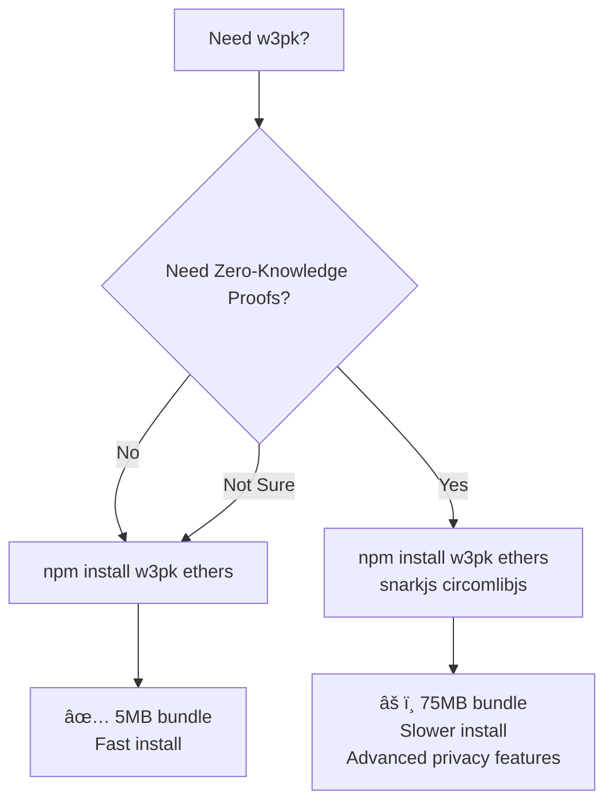

# w3pk Quick Start Guide

## Installation

### Choose Your Installation

w3pk has two configurations based on your needs:

#### Option 1: Core Features Only (Recommended)

**Size**: ~5MB | **Install time**: ~10 seconds
```bash
npm install w3pk ethers
```

**Includes:**
- ✅ WebAuthn passwordless authentication
- ✅ Encrypted wallet management
- ✅ BIP39 HD wallet generation  
- ✅ Message signing
- ✅ Stealth addresses (privacy-preserving transactions)

**Best for:** Most dApps, authentication systems, standard Web3 applications

#### Option 2: With Zero-Knowledge Proofs

**Size**: ~75MB | **Install time**: ~60 seconds
```bash
npm install w3pk ethers
npm install snarkjs circomlibjs  # Optional ZK dependencies
```

**Additional features:**
- ✅ Anonymous membership proofs
- ✅ Private balance threshold proofs
- ✅ Age/value range proofs
- ✅ Anonymous NFT ownership proofs

**Best for:** Privacy-focused dApps, anonymous voting, confidential credential systems

---

## Quick Decision Guide

**Start with core features.** You can always add ZK later if needed.


---

## Usage Examples

### 1. Basic Authentication (Core Features)
```typescript
import { createWeb3Passkey } from 'w3pk'

const w3pk = createWeb3Passkey({
  apiBaseUrl: 'https://webauthn.w3hc.org'
})

// Register new user
await w3pk.register({
  username: 'alice',
  ethereumAddress: '0x...'  // Generated automatically
})

// Login
await w3pk.login()

// Sign message
const signature = await w3pk.signMessage('Hello World')
```

### 2. Wallet Management (Core Features)
```typescript
// Generate new wallet
const wallet = await w3pk.generateWallet()
console.log(wallet.address)   // 0x...
console.log(wallet.mnemonic)  // 12-word phrase

// Export wallet after login
const mnemonic = await w3pk.exportMnemonic()

// Derive HD wallet at index
const derived = await w3pk.deriveWallet(1)
console.log(derived.address)
console.log(derived.privateKey)
```

### 3. ERC-5564 Stealth Addresses (Core Features)

Stealth addresses enable privacy-preserving payments using unlinkable, one-time addresses.

```typescript
const w3pk = createWeb3Passkey({
  apiBaseUrl: 'https://webauthn.w3hc.org',
  stealthAddresses: {}  // Enable ERC-5564 stealth addresses
})

await w3pk.login()

// RECIPIENT: Get your stealth meta-address to share publicly
const metaAddress = await w3pk.stealth?.getStealthMetaAddress()
console.log(metaAddress)  // 0x03f2e32f... (66 bytes, ERC-5564 compliant)
// Share this publicly - it's safe! Senders need it to generate stealth addresses.

// SENDER: Generate stealth address for recipient
const announcement = await w3pk.stealth?.generateStealthAddress()
console.log(announcement.stealthAddress)      // 0x1234... (send funds here)
console.log(announcement.ephemeralPublicKey)  // 0x02abcd... (33 bytes, publish on-chain)
console.log(announcement.viewTag)             // 0xa4 (1 byte, for efficient scanning)

// RECIPIENT: Check if an announcement is for you
const result = await w3pk.stealth?.parseAnnouncement({
  stealthAddress: announcement.stealthAddress,
  ephemeralPublicKey: announcement.ephemeralPublicKey,
  viewTag: announcement.viewTag
})

if (result.isForUser) {
  console.log('Payment found!', result.stealthAddress)
  console.log('Private key:', result.stealthPrivateKey)
  // Use this private key to spend the funds
}

// RECIPIENT: Efficiently scan many announcements
const myPayments = await w3pk.stealth?.scanAnnouncements(announcements)
console.log(`Found ${myPayments.length} payments`)
// View tags enable ~99% skip rate - extremely efficient!
```

**See [ERC-5564 Stealth Addresses Guide](./ERC5564_STEALTH_ADDRESSES.md) for complete documentation.**

### 4. Zero-Knowledge Proofs (Requires Optional Dependencies)

**First, install ZK dependencies:**
```bash
npm install snarkjs circomlibjs
```

**Then use ZK features:**
```typescript
import { createWeb3Passkey } from 'w3pk'
import { buildMerkleTree, generateBlinding } from 'w3pk/zk/utils'

const w3pk = createWeb3Passkey({
  apiBaseUrl: 'https://webauthn.w3hc.org',
  zkProofs: {
    enabledProofs: ['membership', 'threshold', 'range']
  }
})

// Wait for ZK module to initialize
if (!w3pk.zk) {
  console.error('ZK dependencies not installed. Run: npm install snarkjs circomlibjs')
  process.exit(1)
}

try {
  // Membership Proof - Prove you're in a set without revealing which member
  const users = ['0x111...', '0x222...', '0x333...']
  const myIndex = 1
  
  // Build merkle tree
  const leaves = users.map(addr => BigInt(addr).toString())
  const { root, tree } = await buildMerkleTree(leaves)
  
  // Generate proof
  const { pathIndices, pathElements } = generateMerkleProof(tree, myIndex)
  const proof = await w3pk.zk.proveMembership({
    value: leaves[myIndex],
    pathIndices,
    pathElements,
    root
  })
  
  // Verify proof
  const isValid = await w3pk.zk.verifyMembership(proof, root)
  console.log('Membership verified:', isValid)
  // ✅ Proved you're in the set without revealing you're user #1!

  // Threshold Proof - Prove balance > $1000 without revealing exact amount
  const balance = 5000n
  const threshold = 1000n
  const blinding = generateBlinding()
  const commitment = await w3pk.zk.createCommitment(balance, blinding)
  
  const thresholdProof = await w3pk.zk.proveThreshold({
    value: balance,
    blinding,
    threshold,
    commitment
  })
  
  const meetsThreshold = await w3pk.zk.verifyThreshold(
    thresholdProof,
    commitment,
    threshold
  )
  console.log('Balance > $1000:', meetsThreshold)
  // ✅ Proved balance > $1000 without revealing $5000!

  // Range Proof - Prove age 18-65 without revealing exact age
  const age = 25n
  const ageBlinding = generateBlinding()
  const ageCommitment = await w3pk.zk.createCommitment(age, ageBlinding)
  
  const rangeProof = await w3pk.zk.proveRange({
    value: age,
    blinding: ageBlinding,
    min: 18n,
    max: 65n,
    commitment: ageCommitment
  })
  
  const inRange = await w3pk.zk.verifyRange(rangeProof, ageCommitment, 18n, 65n)
  console.log('Age 18-65:', inRange)
  // ✅ Proved age in range without revealing 25!

} catch (error) {
  if (error.message.includes('snarkjs') || error.message.includes('circomlibjs')) {
    console.error('ZK dependencies missing. Install: npm install snarkjs circomlibjs')
  } else {
    console.error('Error:', error)
  }
}
```

### 5. NFT Ownership Proof (Zero-Knowledge)
```typescript
import { createWeb3Passkey } from 'w3pk'
import { 
  buildNFTHoldersMerkleTree,
  generateNFTOwnershipProofInputs 
} from 'w3pk/zk/utils'

const w3pk = createWeb3Passkey({
  apiBaseUrl: 'https://webauthn.w3hc.org',
  zkProofs: { enabledProofs: ['nft'] }
})

// Prove you own an NFT without revealing which one or your exact address
const nftContract = '0xBC4CA0EdA7647A8aB7C2061c2E118A18a936f13D' // e.g., BAYC
const allHolders = ['0x111...', '0x222...', '0x333...'] // All NFT holders
const yourAddress = '0x222...'

const { nftProofInput } = await generateNFTOwnershipProofInputs(
  yourAddress,
  nftContract,
  allHolders
)

const proof = await w3pk.zk.proveNFTOwnership(nftProofInput)
const isValid = await w3pk.zk.verifyNFTOwnership(
  proof,
  nftContract,
  nftProofInput.holdersRoot,
  1n // Prove ownership of at least 1 NFT
)

console.log('NFT ownership verified:', isValid)
// ✅ Proved NFT ownership without revealing which NFT or exact address!
```

---

## Adding ZK to an Existing Project

If you started with core features and now need ZK:
```bash
# 1. Install ZK dependencies
npm install snarkjs circomlibjs

# 2. Update your imports
# Before:
import { createWeb3Passkey } from 'w3pk'

# After (add ZK imports):
import { createWeb3Passkey } from 'w3pk'
import { ZKProofModule } from 'w3pk/zk'
import { buildMerkleTree, generateBlinding } from 'w3pk/zk/utils'

# 3. Enable ZK in config
const w3pk = createWeb3Passkey({
  apiBaseUrl: 'https://webauthn.w3hc.org',
  zkProofs: {
    enabledProofs: ['membership', 'threshold']
  }
})
```

---

##